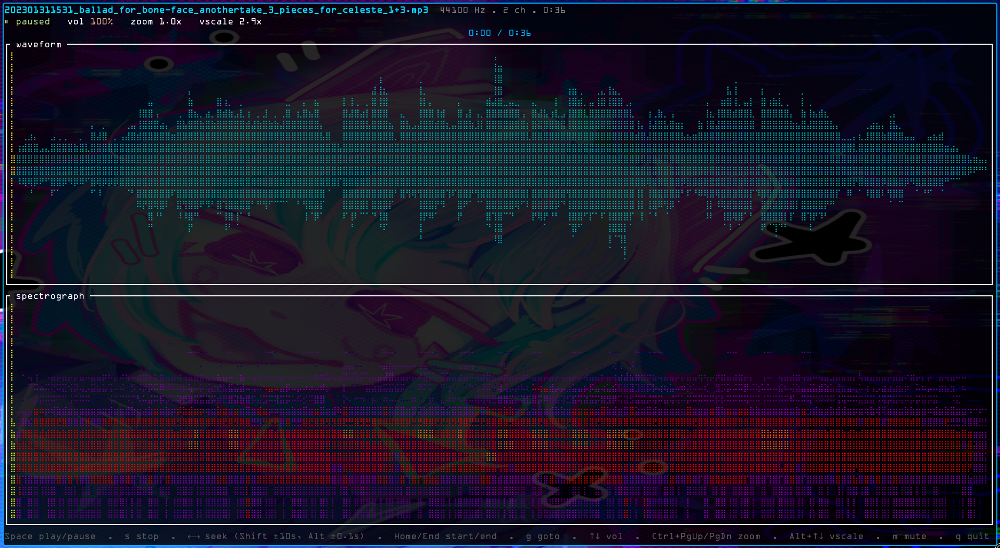
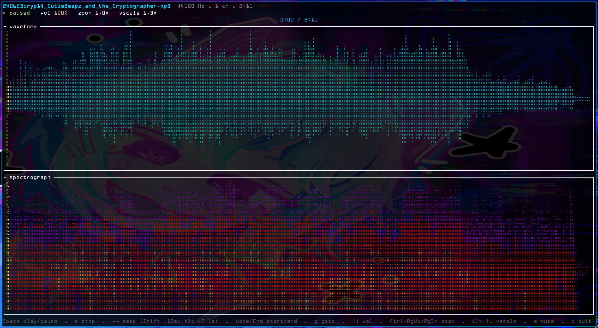

# wavfomo

A terminal audio player written in Rust. Play audio files from the command line
with real-time waveform and spectrograph visualizers, transport controls, and
keyboard-driven navigation.  Ratatui time, in the terminal, because gay.

NOTICE: This is a slop project.

# Cat's eye view



> **Status:** Early implementation. A working first version plays audio with
> full-track waveform and spectrograph visualizers, configurable hotkeys, a
> TOML config file, and a clap-based CLI. Stereo visualizer mode and an in-TUI
> precompute progress bar are still pending (see notes below).

## Goals

- Play common audio formats directly from the shell.
- Provide a responsive, keyboard-first TUI (text user interface).
- Visualize audio: full-track **waveform** and **spectrograph** overviews you can
  zoom and navigate, both precomputed when a file loads.
- Feel instant — play/pause, seeking, and hotkeys should have no perceptible lag.

## Features

### Playback
- **Play / pause** toggle.
- **Stop** and return to the start of the track.
- **Variable-length seek** — three step sizes: fine (±0.1s), normal (±1s), and
  large (±10s), plus seek-to-position. All configurable.
- Accurate elapsed / remaining time and a seek/progress bar.
- Volume control (up / down / mute).

### Format support
Decode and play at least:
- **WAV** (PCM)
- **FLAC**
- **Ogg Vorbis** (`.ogg`)
- **MP3**

Additional formats (AAC/M4A, Opus) are stretch goals, gated by what the decoder
backend supports. Format is detected from file contents where possible, not just
the extension.

### Visualizers
Both visualizers are **full-track**: computed once when a file loads (see
[Loading & precompute](#loading--precompute)) so the entire track can be zoomed
and navigated, not just a live rolling window.

- **Waveform** — amplitude envelope across the whole track, rendered with
  terminal block/braille glyphs. Zoomable (horizontal) with adjustable vertical
  (amplitude) scale.
- **Spectrograph** — short-time FFT across the whole track showing frequency
  content over time (intensity mapped to color). Configurable FFT window size,
  window function, and a linear or logarithmic frequency axis.
- **Channel modes** — each visualizer can render in **mono** (channels
  downmixed, the default) or **stereo** (channels shown separately).
- Both adapt to terminal width/height and redraw on resize; a playhead marker
  tracks the current position.

### Command-line interface
- Launch with a single file: `wavfomo <FILE>` _(multi-file playlists are
  **FUTURE** — see [Non-goals](#non-goals-for-now))_.
- A TUI showing: now-playing metadata, transport state, progress/seek bar,
  waveform pane, and spectrograph pane.
- **Hotkeys** for all transport and navigation actions (see below).
- Graceful handling of terminal resize.
- If the file can't be opened or decoded, exit with a clear error before
  entering the TUI (see [Error handling](#error-handling)).

## Hotkeys

These are the built-in defaults. Every binding can be remapped in the
`[hotkeys]` section of the config file (see [Configuration](#configuration)).

| Key                     | Action                                                        |
| ----------------------- | ------------------------------------------------------------- |
| `F1`                    | Toggle the menu / keybindings overlay (`Esc` also closes it)   |
| `Space`                 | Play / pause                                                  |
| `s`                     | Stop (return to start)                                        |
| `←` / `→`               | Seek the playhead (±1s, normal step)                          |
| `Shift+←` / `Shift+→`   | Seek by a larger step (±10s)                                  |
| `Alt+←` / `Alt+→`       | Seek by a fine step (±0.1s), for a zoomed-in waveform         |
| `Ctrl+PgUp` / `Ctrl+PgDn` | Increase / decrease waveform **zoom** (horizontal, ±10%)     |
| `Alt+↑` / `Alt+↓`       | Increase / decrease waveform **vertical scale** (amplitude, ±10%) |
| `↑` / `↓`               | Volume up / down                                              |
| `m`                     | Mute toggle                                                   |
| `q` / `Esc`             | Quit                                                          |
| `n` / `p`               | Next / previous track — **FUTURE** (no playlist yet)          |

**Navigation model.** The `←` / `→` keys seek the **playhead** directly (there
is no separate, decoupled cursor for now — a movable cursor independent of
playback is **FUTURE**). The modifier variants seek at different granularities so
you can navigate both the whole track and a zoomed-in region:

- **Plain `←` / `→`** — normal step, ±1s.
- **`Shift+←` / `Shift+→`** — large step, ±10s, for coarse navigation.
- **`Alt+←` / `Alt+→`** — fine step, ±0.1s, for when the waveform is zoomed in
  and you want precise placement.

All three step sizes are configurable (`[seek]`).

The vertical arrows split by modifier: plain adjusts **volume** and `Alt` changes
the waveform's **vertical scale** (amplitude magnification). Waveform **zoom**
(how much of the track fills the width) is on `Ctrl+PageUp` / `Ctrl+PageDown`.
Zoom and vertical-scale each step by ±10% per press for now (a configurable step
is **FUTURE**).

> **Terminal note:** `Shift+↑/↓` and `Shift+PageUp/PageDown` are reserved by many
> terminals (e.g. VTE-based ones like xfce4-terminal) for scrollback and never
> reach the app, which is why zoom defaults to `Ctrl+PageUp/PageDown`. If your
> terminal binds those to tab-switching, remap `waveform_zoom_in/out` in
> `[hotkeys]` to keys it leaves free.

## Command-line usage (planned)

```
wavfomo [OPTIONS] <FILE>

Arguments:
  <FILE>               Audio file to play (multi-file playlists are FUTURE)

Options:
  --config <PATH>       Use a specific config file (overrides the default path)
  --fft-size <N>        FFT window size for spectrograph [config: spectrograph.fft_size]
  --no-viz              Disable both visualizers for this run
  --volume, --vol <0-100>  Initial volume               [config: audio.volume]
  -v, --verbose         Print extra diagnostic output (config source, file info)
  -h, --help            Print help
  -V, --version         Print version
```

Command-line options override the config file for that run; the config file
overrides the built-in defaults. See [Configuration](#configuration) for the
full set of persistent settings.

## Configuration

wavfomo reads a **TOML** config file at startup. If none exists, the built-in
defaults apply and the app still runs. Precedence (lowest to highest):

1. Built-in defaults
2. Config file
3. Command-line options (for the current run only)

**Location.** Config files are searched in this order; the **first existing file
wins** (they are not merged):

1. `./wavfomo.config` (current directory)
2. `~/.wavfomo.config`
3. `$XDG_CONFIG_HOME/wavfomo/config.toml`
4. `~/.config/wavfomo/config.toml`

An explicit `--config <PATH>` overrides the search. A missing file falls back to
built-in defaults; an existing file that fails to parse is a startup error. See
[`wavfomo.config`](wavfomo.config) in the repo for a sample listing every entry
at its default value.

### Example `config.toml`

```toml
[audio]
volume = 100              # starting volume, 0–100

[colors]
depth = "256"             # terminal color depth (256-color target)
background = "transparent" # "transparent" uses the terminal's own background

[seek]
fine = 0.1                # Alt+←/→ step, seconds
normal = 1.0              # ←/→ step, seconds
large = 10.0              # Shift+←/→ step, seconds

[waveform]
generate = true           # compute the waveform data
show = true               # display the waveform pane
channels = "mono"         # "mono" (downmixed) or "stereo" (per-channel)
zoom = "fit"              # "fit" shows the whole file; a number zooms in
vertical_scale = 1.0      # amplitude magnification
color_preset = "aurora"   # named 256-color palette

[spectrograph]
generate = true           # compute the STFT across the whole track on load
show = true               # display the spectrograph pane
channels = "mono"         # "mono" (downmixed) or "stereo" (per-channel)
fft_size = 2048           # FFT window size (power of two)
window = "hann"           # analysis window function
overlap = 0.5             # fraction of window overlap between frames (hop = 50%)
magnitude = "db"          # "db" (log) or "linear" intensity mapping
scale = "log"             # frequency axis: "log" or "linear"
color_preset = "inferno"  # named 256-color palette

[hotkeys]
# Every action can be rebound. Values use "Modifier+Key" syntax;
# modifiers: Shift, Alt, Ctrl. Keys: Left, Right, Up, Down, Space, Esc,
# single characters, etc.
play_pause          = "Space"
stop                = "s"
seek_back           = "Left"
seek_forward        = "Right"
seek_back_large     = "Shift+Left"
seek_forward_large  = "Shift+Right"
seek_back_fine      = "Alt+Left"
seek_forward_fine   = "Alt+Right"
waveform_zoom_in    = "Ctrl+PageUp"
waveform_zoom_out   = "Ctrl+PageDown"
vscale_increase     = "Alt+Up"
vscale_decrease     = "Alt+Down"
volume_up           = "Up"
volume_down         = "Down"
mute                = "m"
menu                = "F1"
quit                = "q"
# next_track / prev_track — FUTURE (no playlist yet)
```

### Settings reference

| Section          | Key              | Meaning                                                             |
| ---------------- | ---------------- | ------------------------------------------------------------------ |
| `[audio]`        | `volume`         | Starting volume, 0–100.                                             |
| `[colors]`       | `depth`          | Terminal color depth target (`256`).                               |
| `[colors]`       | `background`     | `transparent` (use the terminal's background) or a color.          |
| `[seek]`         | `fine`           | `Alt+←/→` step in seconds (default `0.1`).                          |
| `[seek]`         | `normal`         | `←/→` step in seconds (default `1.0`).                              |
| `[seek]`         | `large`          | `Shift+←/→` step in seconds (default `10.0`).                       |
| `[waveform]`     | `generate`       | Whether the waveform is computed at all.                           |
| `[waveform]`     | `show`           | Whether the waveform pane is displayed.                            |
| `[waveform]`     | `channels`       | `mono` (downmixed, default) or `stereo` (per-channel).             |
| `[waveform]`     | `zoom`           | `fit` (whole file, default) or a numeric zoom (`Ctrl+PgUp/PgDn`, ±10%). |
| `[waveform]`     | `vertical_scale` | Amplitude magnification (`Alt+↑/↓`, ±10%).                         |
| `[waveform]`     | `color_preset`   | Named palette for the waveform.                                    |
| `[spectrograph]` | `generate`       | Whether the STFT is computed at all.                               |
| `[spectrograph]` | `show`           | Whether the spectrograph pane is displayed.                        |
| `[spectrograph]` | `channels`       | `mono` (downmixed, default) or `stereo` (per-channel).             |
| `[spectrograph]` | `fft_size`       | FFT window size (power of two; default `2048`).                    |
| `[spectrograph]` | `window`         | Analysis window function (default `hann`).                         |
| `[spectrograph]` | `overlap`        | Window overlap fraction between frames (default `0.5`).            |
| `[spectrograph]` | `magnitude`      | Intensity mapping: `db` (default) or `linear`.                     |
| `[spectrograph]` | `scale`          | Frequency axis: `log` (default) or `linear`.                       |
| `[spectrograph]` | `color_preset`   | Named palette for the spectrograph.                                |
| `[hotkeys]`      | _(per action)_   | Rebind any action; see the [Hotkeys](#hotkeys) table.              |

Separating `generate` from `show` lets you hide a pane while still computing it,
or skip the computation entirely (e.g. disable the spectrograph's FFT to save
CPU). `--no-viz` forces both off for a single run regardless of config.

Color presets are named 256-color palettes (e.g. `aurora`, `inferno`, `mono`);
the exact set will be finalized during implementation. The background is
transparent by default, inheriting the terminal's own background.

**Default spectrograph DSP:** Hann window, `fft_size = 2048`, 50% overlap,
magnitude in dB, logarithmic frequency axis. These are conventional
music-analysis defaults and are all overridable above.

## Architecture (intended)

A separation of concerns, to be refined during implementation. The crate stack
below is the committed starting point (already wired into `Cargo.toml`):

- **Decode + output — `rodio`.** rodio handles both container demuxing/decoding
  (via its **bundled `symphonia`**) and streaming to the audio device (via
  `cpal`), and provides the transport primitives we need: play, pause, volume,
  and seek. We deliberately rely on rodio's bundled symphonia rather than
  depending on `symphonia` directly, so only one copy is compiled. Decoded audio
  is exposed as a `Source` (a sample iterator), which we tap to feed the
  visualizers — no separate decode path is required.
- **DSP — `rustfft` + `realfft`.** Both visualizers are computed **once per
  file, up front** (not from a live tap), so the whole track is navigable. On
  load we do a full decode pass and, in one sweep, reduce amplitude per column
  for the waveform and run `realfft` (a real-input wrapper over `rustfft`) as a
  short-time FFT (Hann window, 50% overlap) for the spectrograph. Results are
  cached in memory; playback then just moves a playhead across them.
- **UI — `ratatui` + `crossterm`.** `ratatui` renders the panes; `crossterm`
  provides the terminal backend and keyboard events (hotkeys).
- **App/state.** An event loop coordinates the audio stream, the cached
  visualizer data, and the UI, keeping playback off the render thread so drawing
  never stalls audio. It also loads the config file and applies
  hotkey/visualizer settings.

### Loading & precompute

Because both visualizers cover the whole track, a file load triggers a
full-track analysis pass (decode → waveform peaks + spectrogram frames) before
interactive playback. For large files this is noticeable, so the UI shows a
**progress bar** during precompute. Details to settle during implementation:
whether analysis blocks the UI or streams in progressively, and how downmix
(`channels = "mono"`) vs. per-channel (`stereo`) data is stored.

### Error handling

If the input file can't be opened or decoded, wavfomo **fails before entering
the TUI** and prints a clear CLI error to stderr with a non-zero exit code.
When the failure is an unsupported/unrecognized format, the message names the
format that would need to be added (e.g. _"unsupported format: Opus — not yet
supported"_) rather than a generic decode error.

## Non-goals (for now)

- **Playlists / multi-file playback** (`n`/`p`, multiple `<FILE>` args) — planned
  as **FUTURE**, not in the first version.
- A movable position cursor decoupled from the playhead — **FUTURE**.
- Configurable zoom / vertical-scale step sizes (fixed at ±10% for now) —
  **FUTURE**.
- Full library/collection management or a persistent database.
- Networking / streaming from URLs.
- Audio editing or effects processing.
- A graphical (non-terminal) UI.

## Building

Requires a stable Rust toolchain (Rust 2024 edition) and a system C linker.

```
cargo build --release
cargo run -- <FILE>
```

## Development notes

Working conventions for this repo (including for AI coding assistants):

- **Don't create git worktrees.**
- **Don't `git add` files** — staging is done by the repo owner.
- **Don't commit** on the owner's behalf.
- **Don't push** on the owner's behalf.

Leave changes in the working tree; the repo owner reviews, stages, commits, and
pushes them.

## License

Copyright © 2026 Jojess Fournier.

wavfomo is built on open-source Rust crates. Their licenses (all permissive or
weak-copyleft — MIT, Apache-2.0, BSD, MPL-2.0, etc.) and required copyright
notices are reproduced in [`THIRD-PARTY-LICENSES.html`](THIRD-PARTY-LICENSES.html),
generated from the full dependency tree with [`cargo-about`](https://github.com/EmbarkStudios/cargo-about).
Regenerate it after changing dependencies with `make licenses`.

The accepted set of licenses is enforced by [`cargo-deny`](https://github.com/EmbarkStudios/cargo-deny)
(`make deny`, and automatically in CI via `.forgejo/workflows/licenses.yml`): a
dependency introducing a disallowed (e.g. strong-copyleft) license fails the
check. Its `deny.toml` allow-list is kept in sync with `about.toml`.
